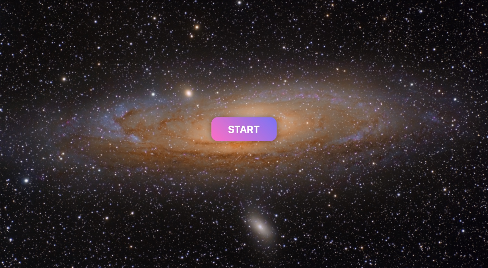
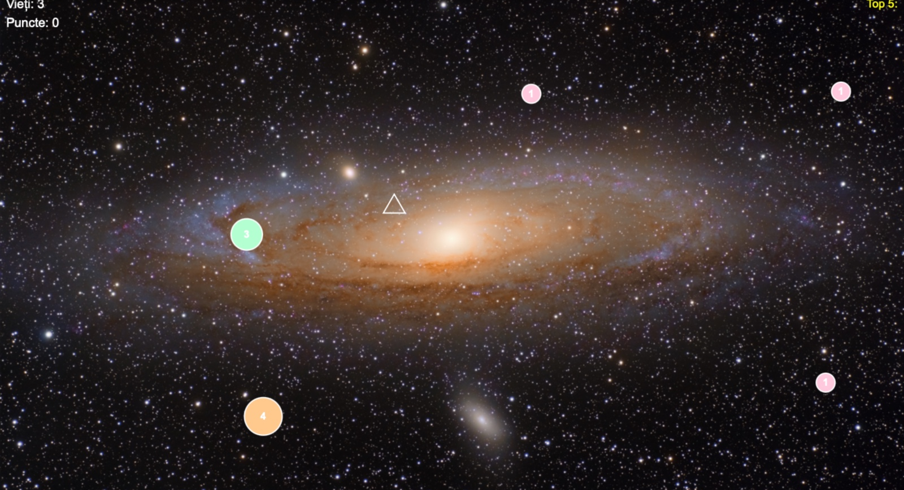
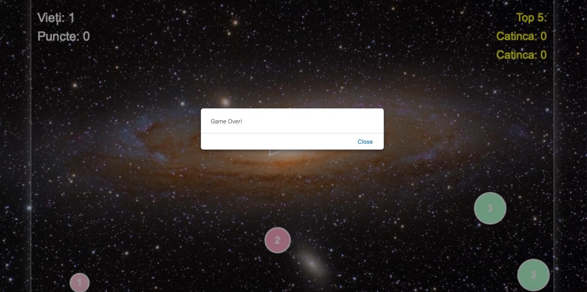

# Asteroid Game

**Asteroid Game** is a browser-based arcade game built with HTML, CSS, and JavaScript.

The project recreates the classic asteroid-dodging and shooting experience in a simple web environment. The player controls a spaceship, avoids incoming asteroids, and tries to survive for as long as possible while interacting with moving objects on the screen.

The game was developed as a frontend project focused on DOM manipulation, event handling, game logic, animations, collision detection, and interactive user experience.

---

## Project Overview

Asteroid Game is designed as an interactive web game where the player controls a spaceship in a space-themed environment.

The main objective is to avoid asteroids, react quickly, and stay alive while the game becomes more dynamic. The project demonstrates how JavaScript can be used to create real-time interactions directly in the browser.

This project combines visual design, user input, movement logic, object generation, and collision detection to create a playable arcade-style experience.

---

## Application Preview

### Start Screen

The start screen introduces the game and allows the player to begin the experience.



---

### Gameplay

The gameplay screen shows the main game area, where the player controls the spaceship and interacts with asteroids.



The game requires attention and quick reactions, as the player must avoid dangerous objects and continue playing for as long as possible.

---

### Player Movement

The spaceship can be controlled by the player using keyboard input.


This part of the project highlights event handling and real-time movement using JavaScript.

---

### Asteroids and Obstacles

Asteroids appear in the game area and create the main challenge for the player.


The movement and positioning of obstacles make the game more dynamic and interactive.

---

### Collision Detection

The game includes collision detection logic, which determines when the player interacts with an asteroid or obstacle.


This feature is essential for the gameplay, because it connects the visual movement of objects with the game rules.

---

### Game Over Screen

When the player loses, the game displays an ending state.



The game over screen completes the gameplay loop and gives the player feedback after the session ends.

---

## Main Features

* Browser-based gameplay
* Space-themed arcade design
* Player-controlled spaceship
* Keyboard-based movement
* Moving asteroids and obstacles
* Collision detection
* Game state management
* Score or progress tracking
* Game over state
* Interactive user experience

---

## Technologies Used

### Frontend

* HTML
* CSS
* JavaScript

### Game Development Concepts

* DOM manipulation
* Event listeners
* Keyboard input handling
* Object movement
* Collision detection
* Game loop logic
* Dynamic visual updates

---

## Project Structure

```txt
AsteroidGame/
│
├── media/
│   └── Images and visual assets used in the game
│
├── 5_1090_Marinescu_MaraCatinca.html
├── 5_1090_Marinescu_MaraCatinca.css
├── 5_1090_Marinescu_MaraCatinca.js
└── README.md
```

---

## How to Run the Game

1. Download or clone the repository.

```txt
git clone https://github.com/catincaam/AsteroidGame.git
```

2. Open the project folder.

3. Open the HTML file in a browser:

```txt
5_1090_Marinescu_MaraCatinca.html
```

The game runs directly in the browser and does not require a backend server.

---

## How to Play

1. Open the game in the browser.
2. Start the game from the initial screen.
3. Control the spaceship using the keyboard.
4. Avoid asteroids and obstacles.
5. Try to survive as long as possible.
6. When the game ends, restart and try again.

---

## Purpose of the Project

The purpose of this project is to practice and demonstrate frontend development concepts through an interactive game.

The project helped apply several important programming concepts, including:

* creating interactive web pages;
* handling user input;
* updating elements dynamically;
* implementing movement logic;
* detecting collisions between objects;
* managing game states;
* organizing HTML, CSS, and JavaScript files.

By building a game instead of a static page, the project focuses on interactivity, logic, and real-time user experience.

---

## Future Improvements

Possible future improvements include:

* Adding multiple difficulty levels
* Adding sound effects
* Adding background music
* Improving the scoring system
* Adding lives or health points
* Adding different asteroid types
* Adding a pause and resume option
* Creating a high score system
* Improving mobile responsiveness
* Adding more advanced animations

---

## Author

Created by **Catinca Marinescu**.

Asteroid Game was developed as a browser-based JavaScript project focused on interactivity, game logic, and frontend programming.
